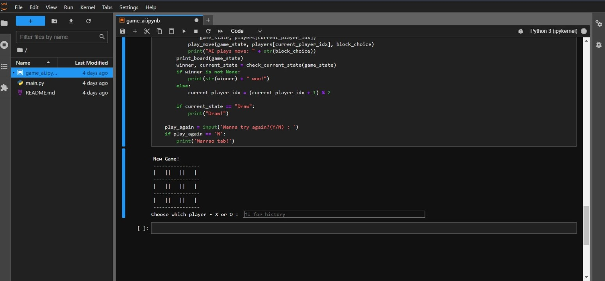
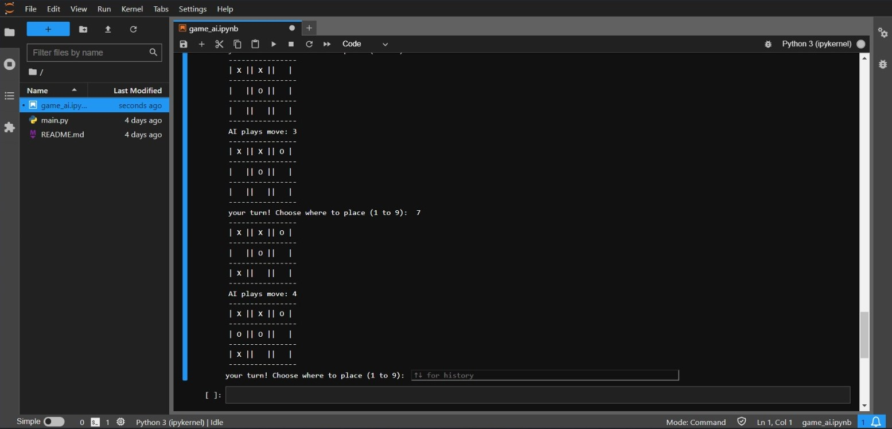

## TicTacToe A.I

>An A.I integrated Game of Tic Tac Toe. In which you can choose between X & O and an A.I will play against you.

 It uses the minimax algorithm to determine the best move for the AI player and allows the user to choose either 'X' or 'O' as their player. The game continues until either the user or the AI player wins or the game ends in a draw. The user is given the option to play again or end the game. Overall, the code is well-structured, easy to understand and provides a good example of implementing the minimax algorithm for game playing AI.

### Knowledge Used

-  Minimax Algorithm: This is a decision-making algorithm used to determine the best move for the AI player. It evaluates all possible moves and selects the one that maximizes the AI player's chance of winning and minimizes the user's chance of winning.

- Recursion: The minimax algorithm is implemented using recursion to evaluate all possible moves and determine the best move for the AI player.

-  2D List: The game state is represented using a 2D list, where each element represents a cell on the game board

- Input/output: The code uses input to get the user's choice of player and block, and output to display the game board and the winner.

-  Flow control: The code uses flow control statements such as if-else and while loops to implement the game logic and control the flow of the program.

- Functions: The code uses functions to implement different parts of the game logic, such as checking the current state of the game, copying the game state, and playing a move.

### Demo game

> If you choose X then AI will play as O , If you choose O then A.I will play X.

